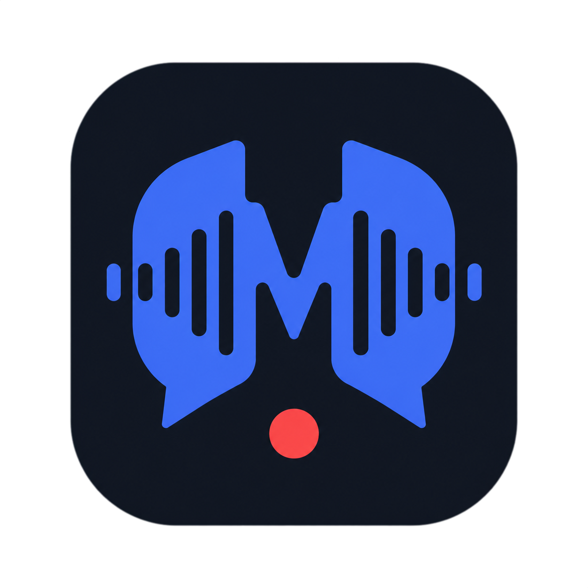
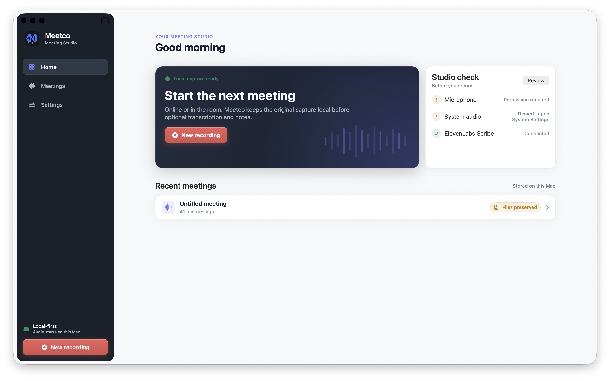
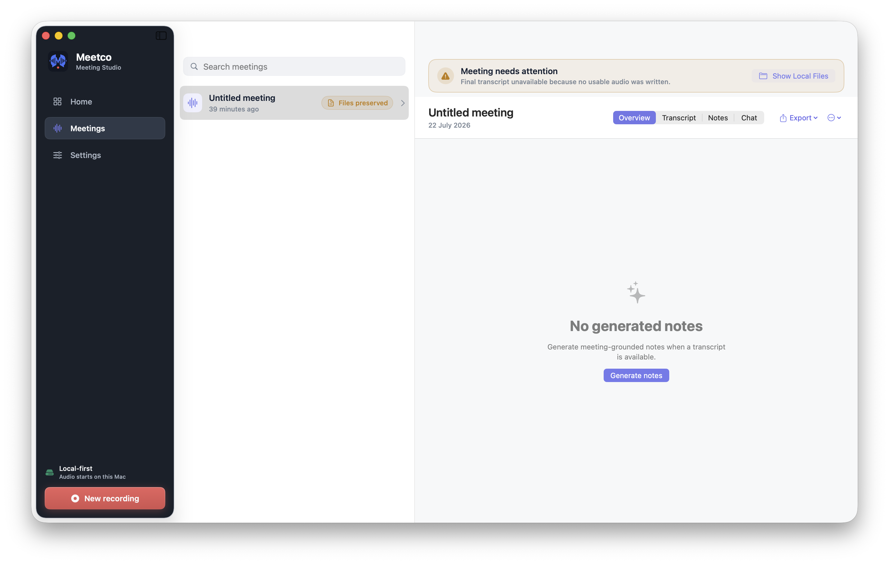
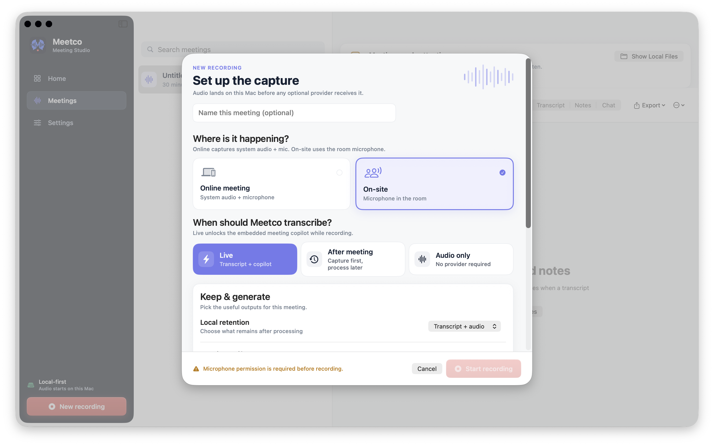
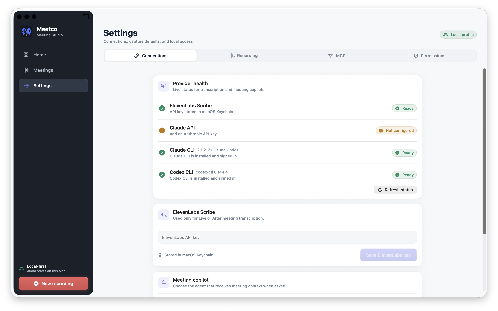

<p align="center">
  
</p>

<h1 align="center">Meetco</h1>

<p align="center">
  <b>Local-first native macOS meeting recorder &amp; copilot.</b><br/>
  Record online or in-room meetings, keep every byte on your Mac,<br/>
  then opt in to transcription and AI notes with <i>your own</i> credentials.
</p>

<p align="center">
  
  
  
  
  
  
  <a href="LICENSE"></a>
  <a href="https://github.com/lequocbinh04/meetco/actions/workflows/release-dmg.yml"></a>
  <a href="https://github.com/lequocbinh04/meetco/releases/latest"></a>
</p>

<p align="center">
  
</p>

---

## Why Meetco

Most meeting recorders upload your audio to someone else's cloud before you ever see a transcript. Meetco flips that: **capture lands on your Mac first**, and every provider — transcription, AI notes, chat — is an optional layer you switch on with your own keys or CLI logins.

- 🎙️ **Two capture modes** — *Online* (system audio + microphone) or *On-site* (room microphone only).
- ⚡ **Live or after-meeting transcription** — ElevenLabs Scribe v2 Realtime while recording, or batch when you stop. Or record audio-only with no provider at all.
- 🤖 **Bring-your-own copilot** — Claude API, Claude CLI, or Codex CLI. Meeting context is sent only when you ask or generate artifacts.
- 📝 **Evidence-linked artifacts** — summary, key points, decisions, actions, open questions, and risks all link back to transcript segments.
- 🔌 **Read-only MCP server** — expose the active meeting snapshot to external agents over stdio JSON-RPC, opt-in per recording, no write tools, no API keys.
- 🔒 **Keychain-only credentials** — API keys live in macOS Keychain under `com.meetco.personal`. Meetco never reads CLI credential files and has no account system.
- 🛟 **Crash-safe by design** — atomic JSON writes, interrupted meetings preserved as recoverable, retained audio validated for real payload before it is trusted.

## Screenshots

| Meeting library &amp; recovery | Recording preflight |
| :---: | :---: |
|  |  |

| Provider connections |
| :---: |
|  |

## Getting started

### Install from a release

Grab the latest `Meetco-*.dmg` from [Releases](https://github.com/lequocbinh04/meetco/releases/latest), drag **Meetco** into *Applications*, and open it. Builds are ad-hoc signed (not notarized), so on first launch right-click the app → *Open*, or allow it under *System Settings → Privacy &amp; Security*. Release DMGs are built for Apple Silicon.

### Requirements

- macOS 14 or later (Apple Silicon or Intel)
- Swift 6 toolchain — full Xcode recommended for the complete test suite and TCC/UI work
- Optional: ElevenLabs API key for transcription
- Optional: Anthropic API key, or a logged-in `claude` / `codex` CLI

No Meetco account and no third-party Swift package required.

### Build and run

```bash
git clone https://github.com/lequocbinh04/meetco.git
cd meetco

swift build -debug-info-format none
swift test -debug-info-format none
swift run -debug-info-format none MeetcoChecks   # deterministic CLI verification

./Scripts/build-app-bundle.sh   # creates and ad-hoc signs dist/Meetco.app
./Scripts/run-meetco.sh         # builds the bundle if missing, then opens it
```

The bundle script places the read-only MCP helper at `dist/Meetco.app/Contents/Helpers/MeetcoMCP`.

### First-run setup

1. Complete or skip onboarding, then grant **Microphone** in *Settings → Permissions* (plus **Screen Recording** for online capture). If a grant was previously denied, enable Meetco in *System Settings → Privacy &amp; Security*, quit, and reopen.
2. Save an ElevenLabs key and/or Anthropic key in *Settings → Connections*.
3. For a CLI copilot, log in from Terminal and refresh provider status in Meetco:

   ```bash
   claude auth status
   codex login status
   ```

   Meetco probes the executable and login state only — it never reads CLI credential files.

## Recording flow

Press <kbd>⌘N</kbd>, pick where the meeting happens and when Meetco should transcribe:

| Mode | What happens |
| --- | --- |
| **Live** | Scribe v2 Realtime transcript + meeting-grounded chat while recording |
| **After meeting** | Local recording first, Scribe v2 batch transcript when you stop |
| **Audio only** | Pure local capture, no provider involved |

Pause/resume anytime. On stop, Meetco drains queued capture events, flushes trailing frames to the realtime session, then finishes batch transcription and artifact generation. A network failure never kills local capture — you get a warning and the recording keeps going.

## Architecture

```
Sources/
├── MeetcoApp/      SwiftUI app — views, session coordinator, design system
├── MeetcoCore/     Models, persistence, transcription clients, agent providers, MCP router
├── MeetcoCapture/  AVFoundation + ScreenCaptureKit audio capture, mixing, WAV/CAF writers
├── MeetcoMCP/      Stdio JSON-RPC server exposing the opt-in meeting snapshot (read-only)
└── MeetcoChecks/   Deterministic CLI verification harness
```

Meeting data lives under `~/Library/Application Support/Meetco/`:

```
Meetings/<meeting-uuid>/
├── meeting.json                 # atomic writes throughout
├── transcript.json              # final transcript
├── transcript-provisional.json  # realtime transcript
├── artifacts.json               # evidence-linked summary/actions/decisions
├── chat.json
├── notes.txt
└── audio/                       # manifest, source CAF tracks, final-mix.wav
Live/current-meeting.json        # only while MCP is enabled
```

Deleting a meeting removes its entire directory. Export writes Markdown, JSON, or the retained WAV mix — and audio export refuses to ship a header-only container as if it were real audio.

## MCP integration

Enable MCP in the recording preflight, then copy the ready-made configuration from *Settings → MCP*:

```bash
"$PWD/dist/Meetco.app/Contents/Helpers/MeetcoMCP" \
  --snapshot "$HOME/Library/Application Support/Meetco/Live/current-meeting.json"
```

The server exposes snapshot, transcript search, segment lookup, and a summary resource. It has no write tools and receives no API key or audio path. Disabling MCP, deleting the meeting, or reaching a terminal failure state revokes the snapshot file.

## Verification status

On a Command Line Tools–only host, `swift build`, `MeetcoChecks`, bundle assembly, plist lint, and strict ad-hoc signature verification all pass; `swift test` compiles but does not discover suites (Xcode required). Real provider calls, TCC capture on hardware, relaunch recovery, and accessibility smoke tests remain to be exercised before relying on Meetco for an important meeting.

## Documentation

- [Product requirements](docs/project-overview-pdr.md)
- [System architecture](docs/system-architecture.md)
- [Design guidelines](docs/design-guidelines.md)
- [Deployment guide](docs/deployment-guide.md)
- [Code standards](docs/code-standards.md)
